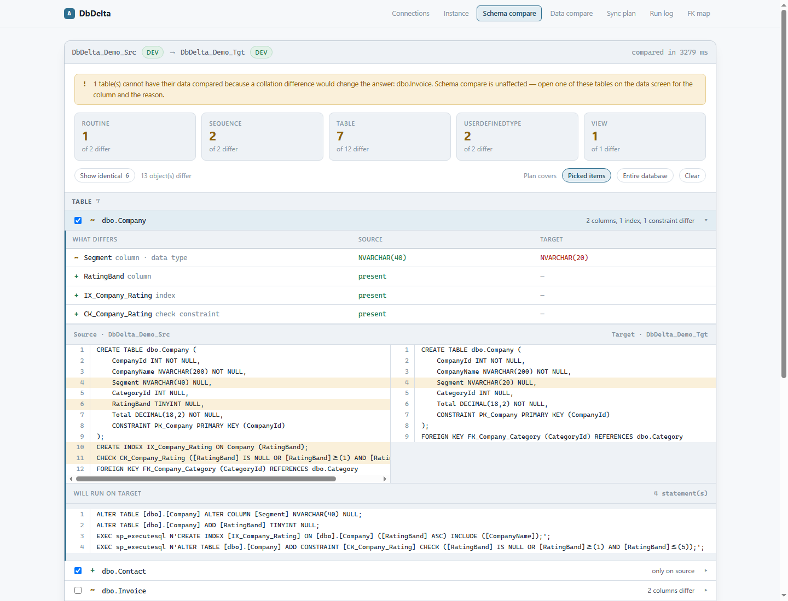

# DbDelta

[](https://github.com/kuntaqi/DbDelta/actions/workflows/build.yml)
[](LICENSE)

Compare two databases — structure and data — then sync one direction.



Schema compare for SQL Server is already solved for free by `sqlpackage`/DacFx. What isn't: free **data**
compare with per-table selective sync and guardrails that stop you writing to the wrong database. That's
the gap this fills.

## What it does

- Compares schema and data between two databases, one direction at a time
- Sync at three granularities: schema only, one table's data, or the whole database
- Per-table data modes — all rows, top N, a `WHERE` filter, or schema only — so a 21 GB table can come
  along as structure while a lookup table comes along as seed data
- Always produces a reviewable `.sql` script; applying it is a separate, opt-in, transactional step
- Shows footprint (how big the object is) separately from transfer (how much this sync actually moves)
- Draws the FK neighbourhood of a table with the sync plan overlaid, so you can see what a sync drags in
  and what it would break
- Surveys every database on one server, or lines up two servers against each other

SQL Server first; the diff engine is provider-abstracted so PostgreSQL can be added without touching it.

## Requirements

- .NET 10 SDK
- Node 20 or newer
- A SQL Server to point it at. SQL Server LocalDB is enough to try it out and is what the tests use.

`sqlcmd`/`bcp` are handy for verifying what it did, but nothing requires them.

## Getting started

The API serves the built SPA from its own `wwwroot`, and `wwwroot` is build output that is not committed.
So a fresh clone has to run the npm build once before `dotnet run` serves anything:

```
cd src/DbDelta.Web
npm install
npm run build          # builds into ../DbDelta.Api/wwwroot

cd ../..
dotnet run --project src/DbDelta.Api
```

Then open **http://localhost:5199**.

If you skipped the npm build, the API still starts but every page is a 404 — that is the symptom, and
re-running `npm run build` is the fix.

### Something to compare

Two demo databases on LocalDB make the UI worth looking at. Create them from the script in the repo:

```
sqlcmd -S "(localdb)\MSSQLLocalDB" -i docs/demo-data.sql
```

That builds `DbDelta_Demo_Src` and `DbDelta_Demo_Tgt` with schema and data differences already in place.
If LocalDB isn't running, start it with `SqlLocalDB start MSSQLLocalDB`.

## A first run through

The screens are **tabs, not a wizard**. A compared pair of connections is the only prerequisite — except
Instance, which needs just a connection — and after that every tab is reachable from every other, in any
order. What follows is one sensible path through them, not a required sequence.

**Connections.** Fill in source and target, or paste a connection string and let it be taken apart for
you. Save either side as a profile to get it back next session. Then compare — that's what unlocks the
rest.

**Instance.** Points at one server and lists every database on it, with sizes. It can also line up two
servers. Worth knowing before you trust that mode: it matches databases **by name**, so where the
environment is part of the name — `AppProd` against `AppUat` — two servers share no names at all, nothing
gets paired, and the result reads like a complete list of differences when it is really a list of things
nobody has lined up. Declare the pairings yourself, and take the warning seriously when it says nothing
matched.

**Schema compare.** One row per object that differs. Click a row and its difference opens inline
underneath — the detail is fetched when it opens, one object at a time, because the emitter runs per
object and a database with hundreds of tables would waste most of that work. Tick what you want in the
plan. **Nothing is ticked for you.** Two scopes are on offer: *Picked items*, or *Entire database* — and
under the second, unticking something records a real exclusion that re-escalating the scope will not undo.

**Data compare.** Pick which tables bring their rows, and in what mode: all rows, top N, a `WHERE` filter,
or schema only. A picked table can then be narrowed to particular rows, but only under all-rows mode and
only from the 200 the screen shows, so narrowing starts from nothing rather than from everything on
screen. Under top-N or filter mode, deletes are suppressed — a row missing from the source only means
"outside the limit" there, and honouring it would empty the target while you thought you were seeding it.

**Sync plan.** The assembled script, in order, to read before anything runs. Empty plan, empty script.
Applying is from here: opt-in, one transaction, `XACT_ABORT ON`. See *Safety* below for what it refuses.

**Run log.** What ran, when, how long, and what the server said.

**FK map.** The foreign-key neighbourhood of a table with the plan overlaid, so you can see what a sync
drags in behind the thing you actually picked.

## Working on the UI

Run the API and the Vite dev server side by side:

```
dotnet run --project src/DbDelta.Api          # port 5199
cd src/DbDelta.Web && npm run dev             # port 5200, proxies /api to 5199
```

Use **http://localhost:5200** for UI work — it hot-reloads. The two ports have to stay in step; the proxy
target is in `vite.config.ts` and the API's port is in `Properties/launchSettings.json`.

## Tests

```
dotnet test --filter "Speed!=Slow"    # ~6s, the inner loop
dotnet test                            # ~50s, run this before committing
```

The integration tests run against LocalDB and create their own scratch databases. If LocalDB is absent
they **skip** rather than fail, so a green run on a machine without SQL Server proves nothing — check for
skips. And the fast half applies no script to any database, so it cannot tell you a script actually runs.

## Configuration

Everything under `Safety` in `appsettings.json` can be overridden in
`src/DbDelta.Api/appsettings.Local.json`, which is gitignored:

| Setting | What it does |
|---------|--------------|
| `Safety:ReadOnlyServers` | Servers that can never be applied to. Script generation still works |
| `Safety:Environments` | Name patterns that classify a server as Dev / UAT / Prod |
| `Safety:MaxDeleteShare` | Deletes above this share of a table raise a warning on the plan |
| `Safety:AllowRemoteAccess` | Turns the non-loopback refusal below into a warning |
| `DbDelta:DataDirectory` | Where profiles and the run log live (`DbDelta__DataDirectory` as an env var) |

Real server-name patterns belong in the local file, not in the committed defaults. Out of the box the
shipped patterns only recognise `*-DEV`, `*-UAT`, `*-PROD` and LocalDB.

State — `profiles.json`, `recent.json` and `runs/` — resolves to `DbDelta:DataDirectory` and falls back to
`%APPDATA%\DbDelta`. **Profiles store no password**: server, port, database, auth mode, username and the
trust flag only. A SQL login password is asked for once a session and kept in memory for that session.

## It only listens on loopback

DbDelta has no authentication, so the address it binds *is* its access control — anyone who can open the
page can apply changes to any database the process can reach. It therefore checks the configured URLs
before the host is built and **refuses to start** if they reach beyond loopback. The refusal happens
before anything binds.

If that is deliberate, `Safety:AllowRemoteAccess` turns it into a warning. Don't put that in committed
config to make a refusal go away. Inside a container the guard defers and says so, because a container has
to bind all interfaces to be reachable at all; there the port publish is the real control.

## Safety

The tool never writes to the source database. Applying to the target is blocked unless:

- the target server is **not** on `Safety:ReadOnlyServers` — that one is a hard block, not a warning
- you type the target database name **exactly**, case sensitive, to confirm
- steps that drop objects or columns, or narrow a column in a way that rewrites existing data, are
  acknowledged explicitly rather than riding along with everything else

All blockers are reported at once rather than one at a time. Applies run in a single transaction with
`XACT_ABORT ON`, and the target is re-checked for drift since the compare — its structure against the
schema that was read, its rows against what they held when the script was built. A drifted target is
refused.

Deletes over `MaxDeleteShare` of a table raise a **warning on the plan**, not a refusal; the judgement
stays yours.

## Docker

`Dockerfile` and `docker-compose.yml` exist, and **neither has ever been built or run**. Treat them as
untested. Two things are true regardless: a Linux container has no Windows identity, so Windows
authentication is unavailable there, and LocalDB accepts local connections only, so a container cannot
reach it — which is why the compose file brings its own SQL Server.

## Layout

```
src/DbDelta.Core/          engine-neutral: model, diff, script assembly, safety
src/DbDelta.SqlServer/     provider: sys.* catalog reader, T-SQL emitter
src/DbDelta.Api/           ASP.NET Core host: endpoints + OpenAPI, serves the built SPA
src/DbDelta.Web/           React 19 + TypeScript + Vite SPA
tests/                     Core, Api, and LocalDB integration tests
```

`Core` never references a provider package. The API is the only thing that touches a database — the SPA
holds no credentials and issues no SQL.

## Status

Working. All seven screens run against real databases. The PostgreSQL provider is not built yet, and one
designed feature is still outstanding: analysis of whether a column change is safe to `ALTER` in place,
which today is always written as a plain `ALTER TABLE … ALTER COLUMN`.

`docs/PLAN.md` is the engineering plan and the source of truth for the design.
`docs/mockup/dbdelta-ux.html` shows the app **as built** — open it in a browser. It ends with a ledger of
ideas the first mockup drew as real that were never implemented, so don't read an old mockup, or a
screenshot of one, as evidence that a feature exists.

If you are an AI assistant working in this repo, read `CLAUDE.md` first.

## Contributing

Contributions are welcome. Read `CONTRIBUTING.md` first; `CLAUDE.md` holds the conventions and the design
ideas a change has to respect. To report a security issue, see `SECURITY.md`.

## License

MIT. See `LICENSE`.
